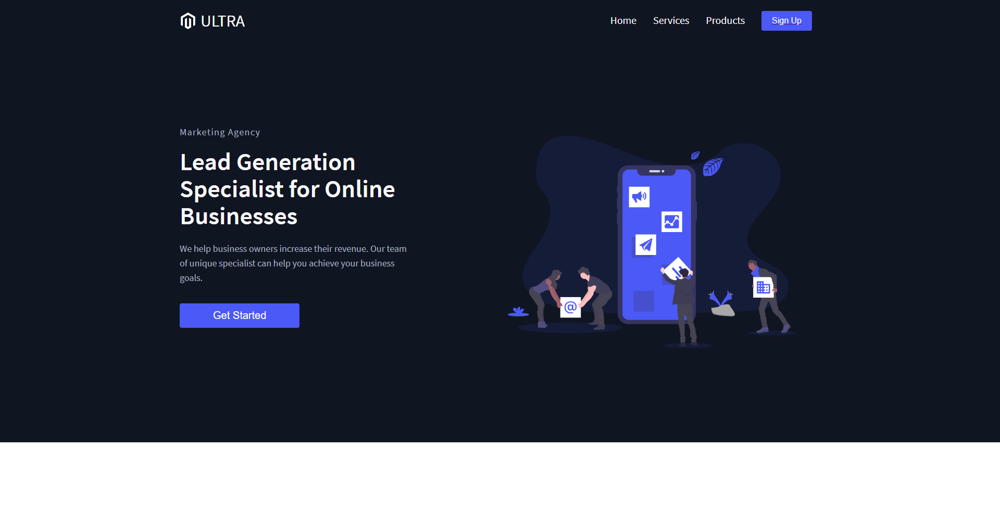

# Marketing Agency w/ ReactJS

## [Check it live here](#)



## About the site
This is a Marketing agency website made with styled components and react router. You can go to different pages easily and access the content. This was easier by the help of react router. 
I was able to code with the help of @Briandesign on Youtube. I got to learn how to use styled componets and react router for the first time. The learning isn't staright forward but with more practice and the documentation for refence, I will make more websites with React. 

## Getting Started

### Installing

Clone the Repository and run

```js
npm install/ npm i
npm run start
```
## Deployment

To deploy simply run

```js
npm run build
```

## Built With

- [React JS](https://reactjs.org/)
- [React Router](https://github.com/ReactTraining/react-router)
- [Styled Components](https://www.styled-components.com)

## Authors

- **Jane Tracy**  - [TracyCss on Dev.to](https://dev.to/tracycss)
